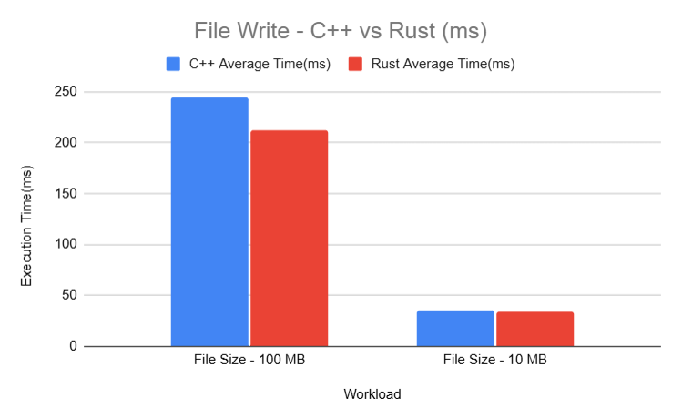
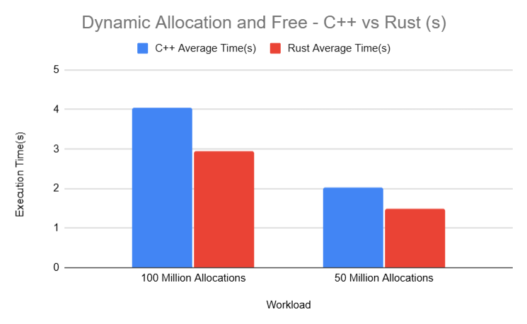

# Language Bench - C++ vs Rust Performance Benchmarking

## Overview

This project presents a systematic performance comparison between **C++** and **Rust** across a set of core benchmarks commonly used to evaluate system-level programming languages. The objective of the project is to analyze execution performance, scalability, and runtime behavior under different workloads using a consistent and reproducible benchmarking methodology.

The benchmarks cover CPU-bound workloads, branch-heavy execution, recursion overhead, file I/O, string processing, and dynamic memory operations. All benchmarks were implemented separately in both C++ and Rust using equivalent logic and were executed under identical conditions to ensure fairness.

Each benchmark was executed multiple times, and **average execution time** along with **standard deviation** was recorded to capture both performance and run-to-run stability.

---

## Benchmarks Implemented

The following benchmarks were implemented in both C++ and Rust in the order listed below, progressing from CPU-bound workloads to I/O- and memory-intensive operations:

### 1. Summation Loop
A simple CPU-bound loop performing integer summation for a fixed number of iterations. This benchmark evaluates raw loop execution speed and compiler optimization efficiency.

### 2. Branch-Heavy Loop
A loop containing frequent conditional branches to analyze branch prediction behavior and control-flow performance under branch-heavy workloads.

### 3. Recursion Benchmark
A recursive function executed with controlled depth to measure function call overhead, stack usage, and recursion handling efficiency.

### 4. File Read Benchmark
Measures sequential file read performance by reading large files from disk, evaluating read throughput and file I/O efficiency.

### 5. File Write Benchmark
Measures sequential file write performance by writing large data blocks to disk, evaluating write throughput and runtime I/O overhead.

### 6. String Parsing
Evaluates performance of character-by-character string parsing over large input sizes, representative of real-world text processing workloads.

### 7. String Concatenation and Substring Search
Measures the performance of repeated string concatenation combined with substring search operations, capturing both string growth overhead and search efficiency.

### 8. Dynamic Allocation and Free
Evaluates dynamic memory allocation and deallocation performance by repeatedly allocating and freeing heap memory under increasing allocation counts.

### 9. Vector Insertions and Deletions
Measures dynamic container performance by repeatedly inserting and deleting elements froma vector-like data structure. 
Large workloads are executed using chunked processing torespect physical memory limits while preserving the total operation count.

---

## Methodology

To ensure a fair and reliable comparison between C++ and Rust, the following benchmarking methodology was followed:

- Identical algorithms and workloads were used in both language implementations.
- All benchmarks were compiled in optimized mode.
- Each benchmark was executed multiple times (typically five runs).
- Average execution time and standard deviation were calculated for each benchmark.
- No background applications were intentionally running during benchmark execution.
- All benchmarks were executed on the same machine, operating system, and compiler environment.

### Large Workloads and Chunking

For very large workloads (e.g., 500 million or 1 billion operations), allocating all data at once is not feasible due to physical memory constraints. In such cases, workloads were executed in **fixed-size chunks** while preserving the total number of operations. This approach maintains algorithmic equivalence while enabling scalable and realistic benchmarking.

---

## System Configuration

All benchmarks were executed on the following system:

### Hardware
- **Processor:** 12th Gen Intel® Core™ i5-1235U @ 1.30 GHz  
- **Installed RAM:** 8 GB (7.7 GB usable)  
- **Architecture:** 64-bit, x64-based processor  

### Operating System
- **OS:** Windows 11 Home Single Language  
- **Version:** 24H2  
- **OS Build:** 26100.7462  

---

## Toolchain and Build Configuration

- **C++ Compiler:** g++ (compiled with `-O3`)
- **Rust Compiler:** rustc (compiled using `rustc -O <filename.rs>`)
- **Timing Mechanisms:**
  - C++: `std::chrono`
  - Rust: `std::time::Instant`

Exact compiler versions and build commands are documented within the repository.

---

## Results

All benchmark results, including individual runs, average execution times, and standard deviation values, are documented in the Google Sheets link below.
A benchmark-wise breakdown with visualizations is presented in the sections that follow.

📊 **Benchmark Results (Google Sheets)**  
https://docs.google.com/spreadsheets/d/1dq5R_SiZNLLnG3HRv5nI7fb26BDp2h8v44QNyywQqNw/edit?usp=sharing

🌐 **Benchmarking Website**  
[Language Bench Website](https://shaggylenoo.github.io/language-bench/)

A summary table consolidating results across all benchmarks and workloads was created to facilitate comparison and visualization.

---

## Benchmark Results

---

### 1. Summation Loop


**What this benchmark tests:**  
Measures raw arithmetic throughput and loop execution efficiency across increasing iteration counts.

**Observations:**
- For very large workloads (10 billion iterations), C++ and Rust show nearly identical performance, with Rust being marginally faster.
- At mid-range workloads (1 billion and 100 million iterations), C++ consistently executes faster than Rust.
- For small workloads (10 million iterations), absolute execution times are very low, but C++ maintains a slight advantage.

Overall, C++ demonstrates lower overhead for tight arithmetic loops, especially at mid-scale workloads.

---

### 2. Branch Loop


**What this benchmark tests:**  
Evaluates performance under branch-heavy execution, focusing on conditional logic and branch prediction behavior.

**Observations:**
- For large workloads (10 billion and 1 billion iterations), Rust outperforms C++, indicating more efficient handling of branch-heavy code paths in this scenario.
- At smaller workloads (100 million and 10 million iterations), execution times for both languages converge, with only minor differences.

Rust shows a consistent advantage in large branch-intensive workloads, while both languages perform similarly at smaller scales.

---

### 3. Fibonacci Recursion


**What this benchmark tests:**  
Measures recursive function call overhead and stack management behavior.

**Observations:**
- At very large recursion counts, Rust significantly outperforms C++, completing deep recursive workloads much faster.
- At mid-range recursion depths, C++ performs better than Rust.
- At smaller recursion depths, Rust again shows lower execution time.

Performance alternates depending on recursion depth, suggesting different optimization strategies and call-handling overheads between the two languages.

---

### 4. File Read


**What this benchmark tests:**  
Evaluates disk I/O performance while reading files of varying sizes.

**Observations:**
- For large files (1 GB and 500 MB), Rust consistently reads data faster than C++.
- At medium file sizes (100 MB), performance between C++ and Rust is nearly identical.
- For small files (10 MB), C++ performs better than Rust.

Since the workload is I/O-bound, language-level differences are secondary to filesystem and OS behavior, becoming more noticeable only at smaller file sizes.

---

### 5. File Write




**What this benchmark tests:**  
Measures disk write performance for files of varying sizes.

**Observations:**
- For very large files (1 GB), C++ shows slightly better performance.
- At medium and small file sizes (500 MB and below), Rust consistently outperforms C++.
- Performance differences decrease as file size decreases, but Rust maintains a small advantage in most cases.

File write performance is influenced heavily by buffering and filesystem behavior, with Rust showing better performance for repeated medium-sized writes.

---

### 6. String Parsing


**What this benchmark tests:**  
Evaluates character-by-character string parsing performance over large input sizes, representative of real-world text processing workloads.

**Observations:**
- For very large inputs (1 billion and 500 million characters), Rust significantly outperforms C++.
- At 100 million characters, Rust continues to maintain a strong performance advantage.
- At small workloads (10 million characters), execution times are low for both languages, but Rust remains faster.

Overall, Rust demonstrates more efficient handling of large-scale string parsing operations.

---

### 7. String Concatenation and Substring Search


**What this benchmark tests:**  
Measures the performance of repeated string concatenation combined with substring search operations.

**Observations:**
- At large data sizes (500 MB), Rust is substantially faster than C++.
- At 100 MB and 50 MB workloads, Rust maintains a clear performance advantage.
- At smaller workloads (10 MB), Rust continues to outperform C++, though the gap narrows.

These results indicate more efficient string handling and memory management in Rust for complex string operations.

---

### 8. Dynamic Allocation and Free




**What this benchmark tests:**  
Evaluates dynamic memory allocation and deallocation performance under increasing allocation counts.

**Observations:**
- At very high allocation counts (100 million and 50 million allocations), Rust performs significantly faster than C++.
- At 10 million allocations, Rust maintains a noticeable advantage.
- At 1 million allocations, performance differences reduce, with both languages showing similar execution times.

Rust’s allocator demonstrates better scalability under heavy allocation pressure.

---

### 9. Vector Insertion and Deletion


**What this benchmark tests:**  
Measures dynamic container performance through repeated insertions and deletions in a vector-like data structure.

**Observations:**
- At extremely large workloads (1 billion and 500 million insertions and deletions), Rust outperforms C++.
- At 100 million operations, Rust continues to show better performance.
- At smaller workloads (10 million operations), execution times are very close, with C++ being marginally faster.

This benchmark highlights Rust’s stronger scalability for large dynamic container workloads.

## Results Summary

Across the benchmarks, performance depends strongly on workload characteristics:

- **C++** performs well in tight arithmetic loops and certain recursive workloads.
- **Rust** shows clear advantages in branch-heavy execution, string processing, vector operations, and most I/O scenarios.
- Differences are most visible at larger workloads, while smaller workloads often converge in execution time.
- Low standard deviation across benchmarks indicates stable and repeatable measurements.

These results highlight that neither language is universally faster; performance varies based on the nature of the workload and execution pattern.


## Visualization and Website

Benchmark results have been visualized using comparative charts (C++ vs Rust) for each benchmark and workload size. These visualizations, along with methodology and observations, are presented on a static website hosted using **GitHub Pages**.

---

## Limitations

- Benchmarks were executed on a single machine and operating system.
- Results may vary across different hardware, OS configurations, or compiler versions.
- Multithreaded and memory-pressure scenarios were not part of the initial benchmarking phase.

---

## Future Enhancements

Planned and potential future enhancements include:

- Benchmarking under different run conditions (e.g., memory pressure).
- Introducing multithreaded benchmarks with varying thread counts.
- Adding additional language comparisons (e.g., Go).
- Automating benchmark execution and result collection.

---

## Repository Structure
```
language-bench/
├── cpp/ # C++ benchmark implementations
├── rust/ # Rust benchmark implementations
├── data/ # Raw and processed benchmark results
├── charts/ # Generated charts and visuals
├── website/ # GitHub Pages website source
└── README.md
```
---

## Conclusion

This project provides a structured and reproducible comparison of C++ and Rust across a variety of fundamental performance benchmarks. By combining careful methodology, repeated measurements, and clear visualization, the project aims to offer practical insights into the real-world performance characteristics of modern systems programming languages.

